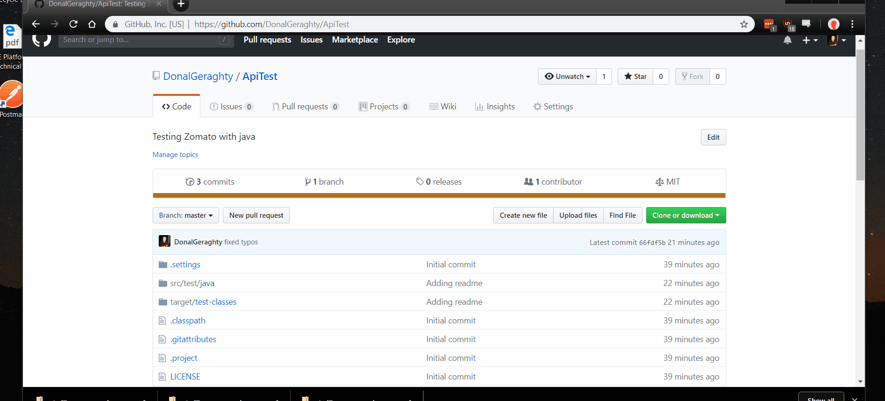

# ApiTest

## Project can be built using any java IDE
https://www.eclipse.org/downloads/packages/

To run these tests download and run on chosen IDE

### Scenarios covered
Testing the api on Zomato: https://developers.zomato.com/documentation#/
1. Asserted the **response code** for "/categories"
2. Asserted the **response header** content type for "/categories"
3. Asserted the **response body** for a known category that is returned as json from "/categories"
4. Asserted the **response code** for "/cities"
5. Asserted the **response body** for a know city that is returned as json from "/cities" search query

### Future work
1. Refactor the tests to use more shared steps.
2. Split up the tests to new test classes when more are added.
3. Create more POJOs for the json objects returned.  
4. Add more scenarios including
Test more **response codes** from endpoints.
Test more **response headers** from more endpoints
